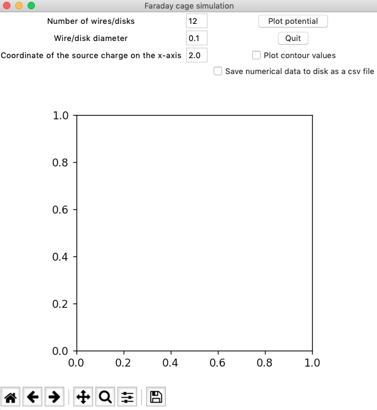
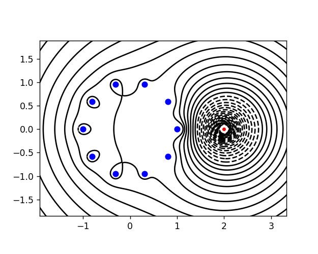

## What is this?
This is an implementation of the algorithm described in [Chapman, S. Jonathan, David P. Hewett, and Lloyd N. Trefethen. "Mathematics of the Faraday cage." Siam Review 57.3 (2015): 398-417](https://people.maths.ox.ac.uk/trefethen/chapman_hewett_trefethen.pdf), written in Python with a tkinter GUI (see Fig. A.1 in the linked paper for equivalent MATLAB code).

I hope that someone will find it useful, informative, and/or entertaining in some way.

I can’t promise this is perfect (e.g. there might be some numerical issues). If you find a a bug, feel free to log a ticket - or better yet, create a PR! There’s a lot of low-hanging fruit that can be added, feature wise. It goes without saying that any errors of this nature are due to myself, and not the authors of the above paper, whom I do not know.

## Installation
You will need a working copy of [Python 3](https://www.python.org/downloads/) (it *might* work in Python 2, but I don't promise anything) and [git](https://git-scm.com/downloads).

You can clone the repository on to your machine with `git clone git@github.com:MartinCapraro/2d-faraday-cage.git`

## Usage
Navigate to the directory where you cloned the repository. Then run `python faraday_gui.py` to open the tkinter GUI.

You should be presented with something that looks like the following: 

You can specify the number of wires, the diameter of the wires, and the distance from the origin to the charge on the x-axis. The entry boxes are prepopulated with some default values.

Clicking the plot potential button should generate a plot for you (see below). There are optional check boxes to save the numerical data to disk as csv (the location defults to `./numerical_output`) and add some potential values to the plot.

You can zoom, pan, save a copy of the plot, etc.

For advanced/custom usage (e.g. changing the size of the area that is plotted, or adding functionality) you will have to dig into the code yourself. It is pretty straightforward, and anyone with some experience in scientific computing should be able to figure out what’s going on.

## License
This is released under the MIT License, so go wild.